# justinne_gramonte.github.io
This portfolio is a collection of my previous work in printed circuit board (PCB) design for fabrication. It includes photographic documentation of various PCBs I have designed and produced utilizing the Eagle PCB software and Sketchup.

## Overview
I am a Computer Engineering graduate with a proven track record in PCB design and fabrication. I have hands-on experience designing and building PCBs for diverse applications such as microcontroller circuits, simple computers, monitoring systems, and power supplies, utilizing Eagle CAD for all designs.

## Projects
The Portfolio includes pictures of my projects that I have submitted to our schools as my activities:
-Microcontroller AVR Board
-LED IO Board
-8x8 LED Matrix
-LCD Display
-Motor Controller
-SAP-1 Circuit Blocks

## Skills
Practical PCB Design and Implementation Skills

-PCB Design and Routing: Utilizing Eagle CAD for schematic capture and layout, adhering to best practices in PCB routing.
-Component Selection and Placement: Expertise in selecting appropriate components and connectors for optimal performance, and strategic component placement for efficient signal routing and thermal management.
-Footprint Creation: Proficiency in creating custom footprints for unique or non-standard components.
-PCB Assembly: Hands-on experience in soldering and assembling PCBs, including both SMT and through-hole techniques.

## A Visual Showcase
The following images provide a visual representation of my previous work in PCB design and fabrication.

-Drill 1.0 LED IO Board   
| 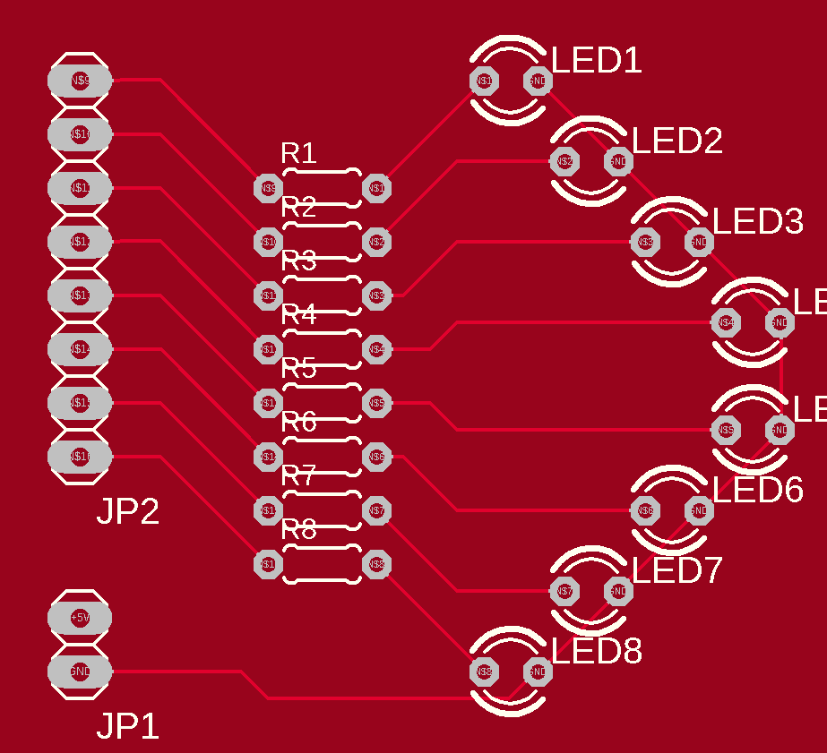 | 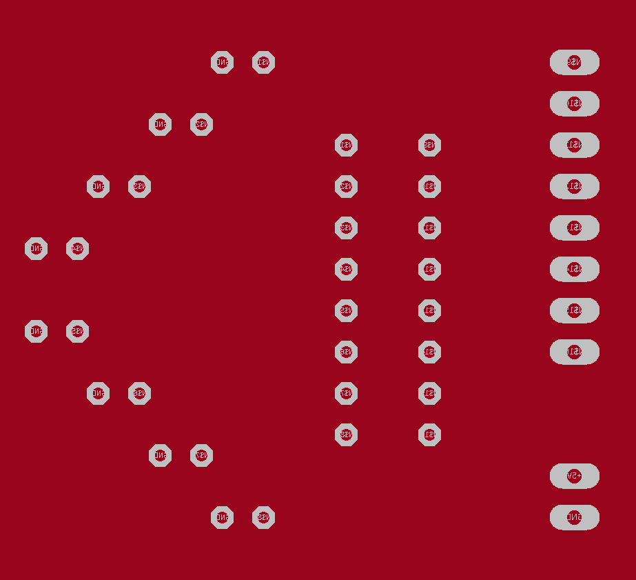 | 
-Drill 2.0 AVR Breakout Board  
| 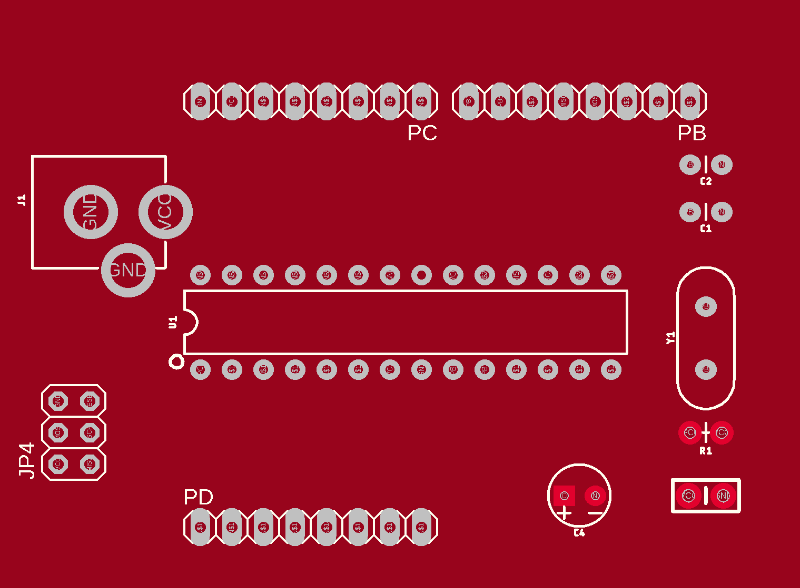 | 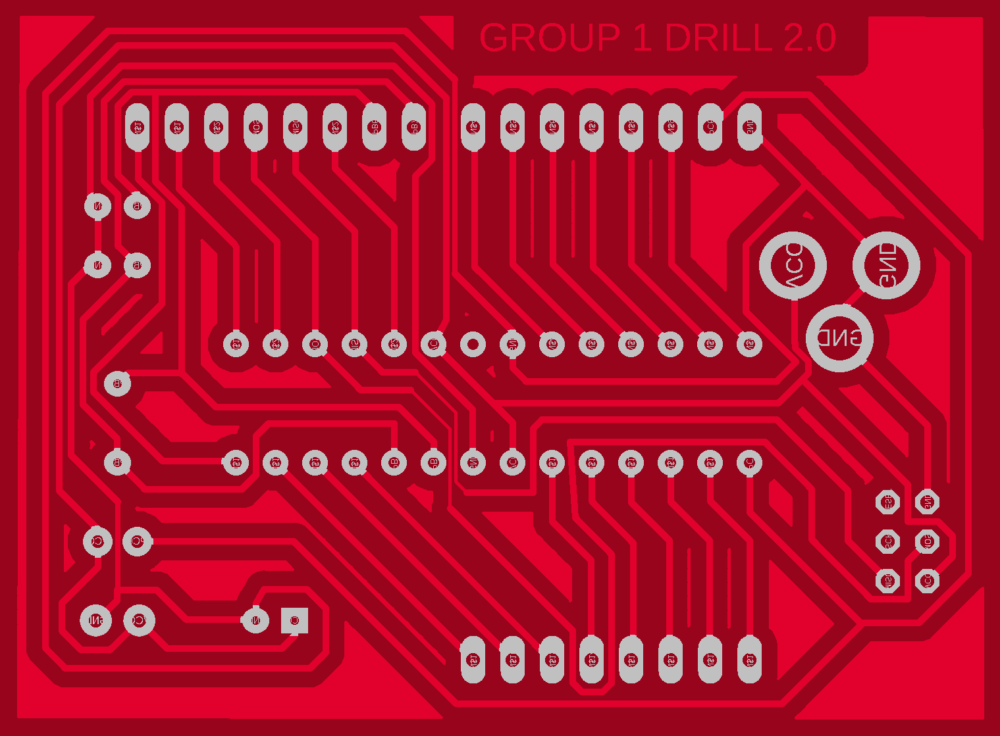 | 
-Drill 3.0 8x8 LED Marix  
| 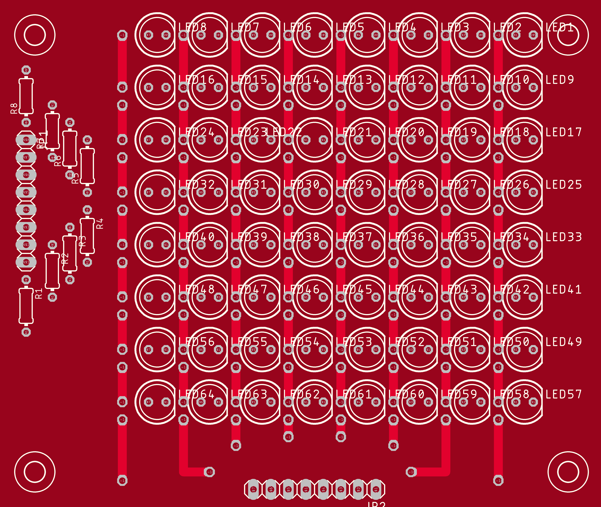 | 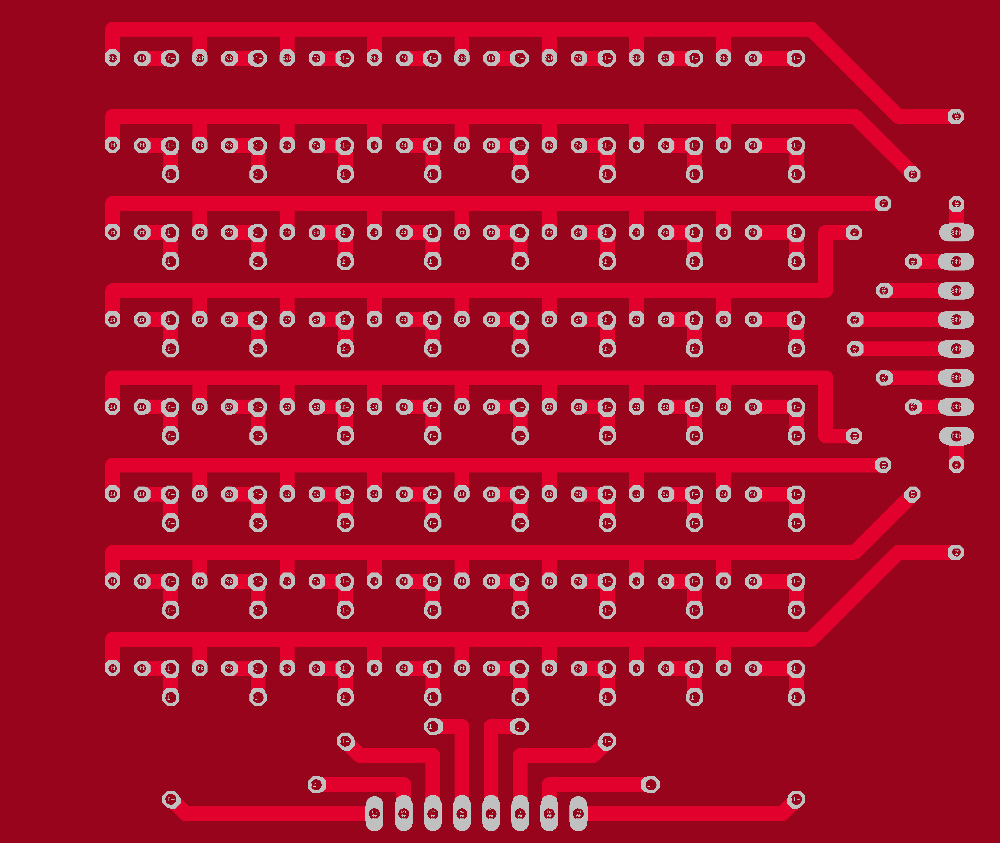 | 
-Drill 4.0 7-Segment Display  
| 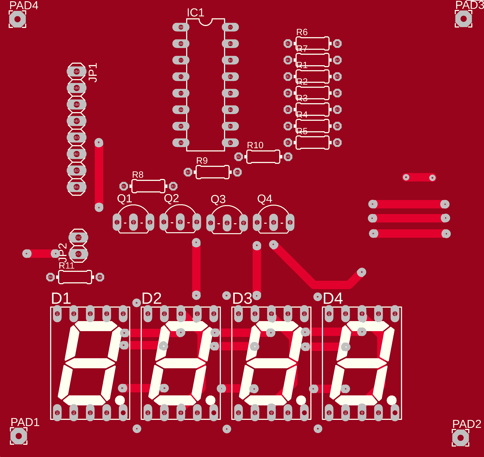 | 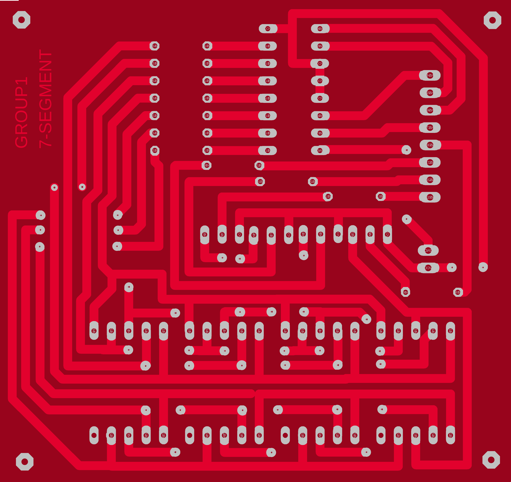 | 
-Drill 5.0 LCD Board  
| 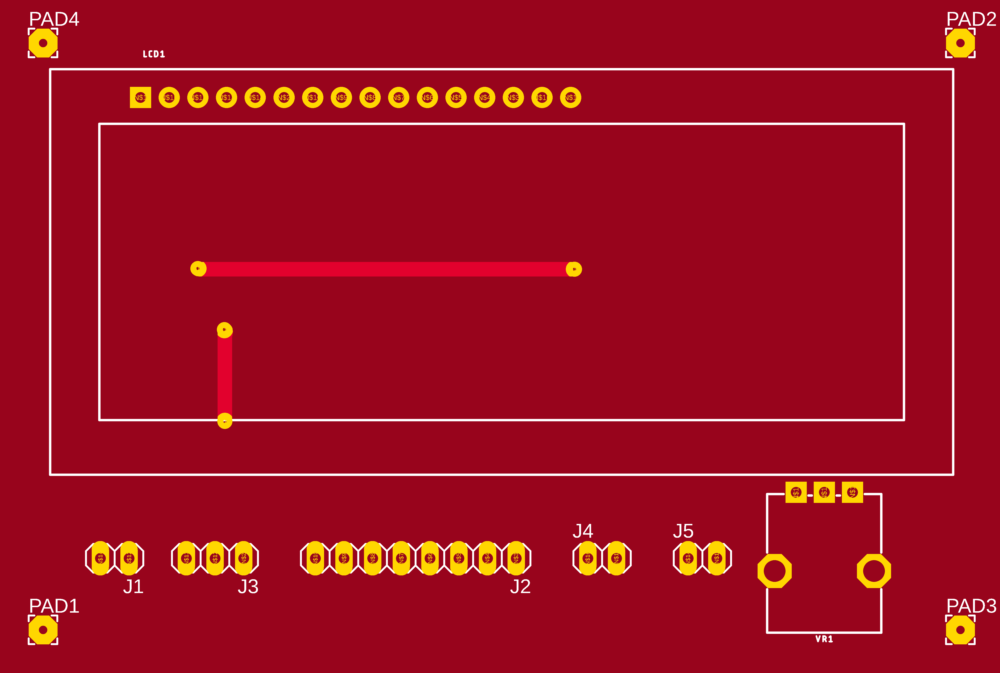 | 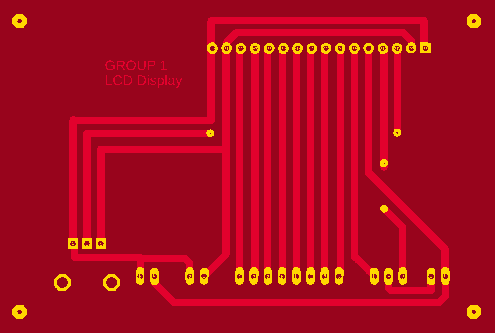 | 
-Drill 6.0 2 Channel Motor Driver  
| 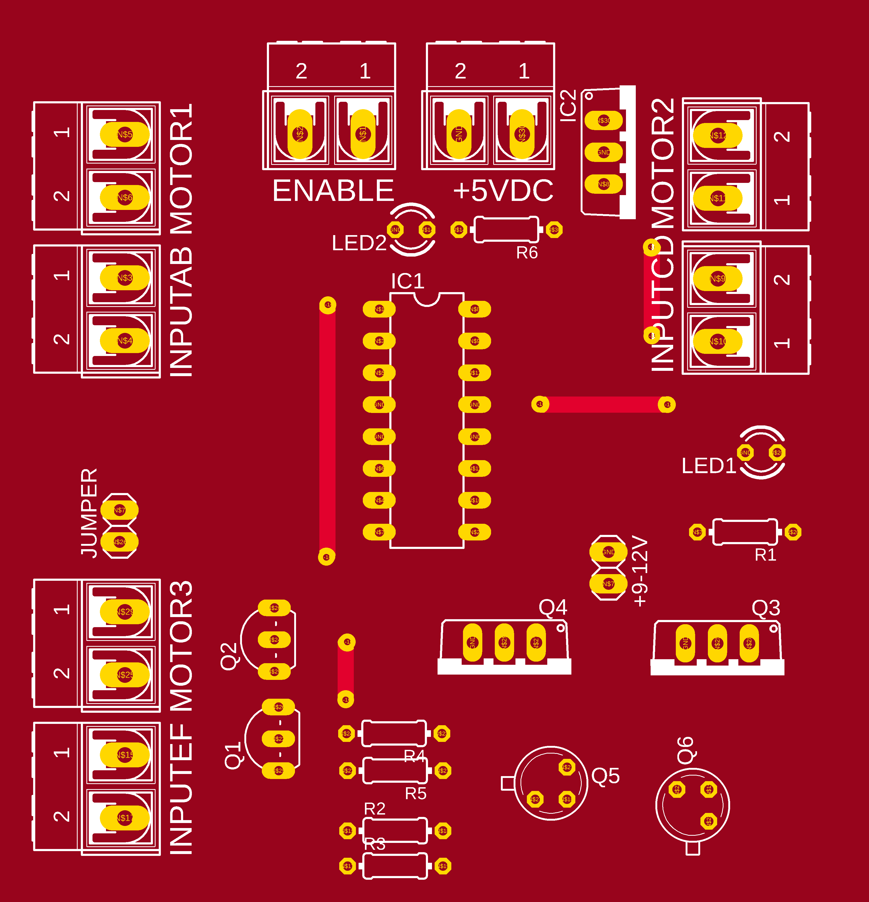 | 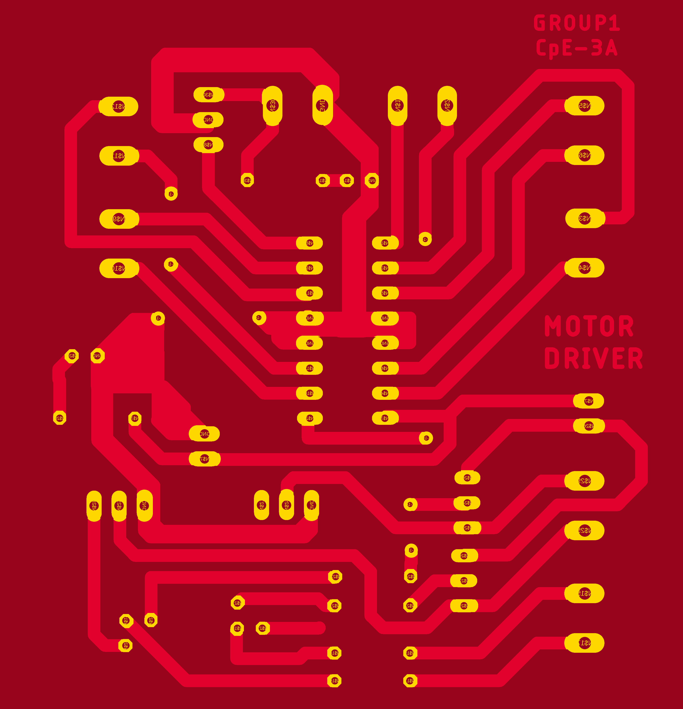 | 
-Final Project Power Supply  
|  |  | 
